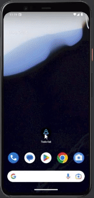

# To Do List - Mobile
This is a simple mobile application developed in React Native using Expo and Typescript. 
The application is an **to-do list**, which contains the followig functionalities:

- Add a new task.
- Mark and unmark a task as completed.
- Remove a task from the list.
- Show the completion progress of tasks.

## App Demo

> 

## How to use the app

### Appetize simulator

Click on the link below to try out the application in the online emulator:

> [Appetize.io](https://appetize.io/app/pkxjll2gugnzyf3lfta3bcve2m)

### Local environment

To use the app in your local environment, follow the instructions below:

#### Prerequisites

Before getting started, make sure you have the following installed on your system:

1. [Node.js](https://nodejs.org) - Ensure that Node.js is installed in version 12 or higher.
2. [npm](https://www.npmjs.com/) - You need npm installed to manage the project's dependencies.
3. [Expo CLI](https://expo.dev/) - Make sure you have Expo CLI installed globally on your machine.

#### Cloning the repository

To clone the repository to your local machine, run the following command in your terminal:

```
git clone git@github.com:LucasAccurcio/todo-list-mobile.git
```

#### Installing dependencies

After cloning the repository, navigate to the project directory and install the necessary dependencies using npm:

```
cd todo-list-mobile
npm install
```

#### Starting the application

With the dependencies installed, you can start the application using Expo. Simply run the following command:

```
npx expo start
```

A web page will open in your browser, where you can choose to run the app on an emulator or your own mobile device using the Expo Go app.

Now you can start using the app and test its simple functionalities for displaying event information and managing participants.

## License

This project is licensed under the [MIT License](license-link). Feel free to use, modify, and distribute it under the terms of the license.
